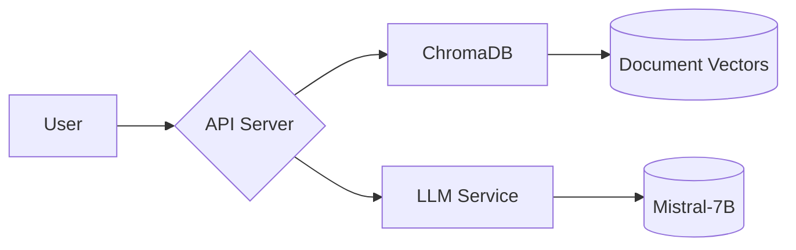

# 🏢 Corporate Documentation Virtual Assistant 🤖

## 📖 Overview

This project is a virtual assistant designed to help employees navigate corporate documentation. It uses Mistral-7B, a state-of-the-art language model, to provide intelligent answers and semantic search capabilities. The system is built with security and ease of deployment in mind, using Docker for containerization.

## ✨ Features

| Feature | Description |
|---------|-------------|
| 🔍 Semantic Search | Find documents using meaning, not just keywords |
| 🧠 Intelligent Answers | Mistral-7B generates human-like responses |
| 📂 Document Chunking | 512-token chunks with 10% overlap for context |
| 📌 Source Citation | Always shows where answers came from |
| 🛡️ Secure Design | Non-root containers and updated dependencies |
| 🐳 Easy Deployment | Fully containerized with Docker |

## 🚀 Quick Start

### Prerequisites

- Docker 20.10+
- 8GB RAM (16GB recommended)
- Linux/macOS/WSL2

```bash
# 1. Clone the repository
git clone https://github.com/your-repo/corporate-assistant.git
cd corporate-assistant

# 2. Make scripts executable
chmod +x 2008_isnt_that_long_ago-I_ve_respect_for_those_who_were_children_back_then.sh
chmod +x models/download_models.sh

# 3. Run the magic script! (This will take ~15-30 minutes)
./2008_isnt_that_long_ago-I_ve_respect_for_those_who_were_children_back_then.sh
```

## 🏗️ System Architecture



### Components

1. **FastAPI App** (Port 8000)
   - Handles requests/responses
   - Manages document processing
2. **ChromaDB** (Port 8001)
   - Vector similarity search
   - HNSW indexing
3. **LLM Service** (Port 8002)
   - Mistral-7B 4-bit quantized
   - llama.cpp for CPU efficiency

## 📡 API Reference

### Ingest Documents

```bash
POST /ingest
{
  "text": "Your policy document text...",
  "doc_id": "hr_policy_2023"
}
```

### Search Documents

```bash
GET /search?query=remote+work+policy&doc_id=hr_policy_2023
```

### Ask Questions

```bash
POST /ask
{
  "query": "How many vacation days per year?",
  "context": ["doc1_chunk3", "doc2_chunk1"]  # Optional
}
```

## 🧩 How It Works

1. **Document Processing**:

   ```python
   # Sample chunk creation
   {
     "text": "Employees get 20 vacation days...",
     "doc_id": "hr_policy",
     "embedding": [0.23, -0.54, ..., 0.12]  # 384-dim vector
   }
   ```

2. **Search Flow**:

   ```plaintext
   User Query → Embedding Generation → Vector Search → LLM Synthesis → Response
   ```

3. **Security Measures**:

   - Non-root Docker containers
   - Regular dependency updates
   - Isolated network between services

## ⚙️ Configuration

| File | Purpose |
|------|---------|
| `app_service/utils/chunking.py` | Adjust chunk size/overlap |
| `llm_service/start_llm.sh` | Change LLM parameters |
| `docker-compose.yml` | Resource limits, ports |

```bash
# To modify resources:
docker-compose.yml
services:
  llm:
    deploy:
      resources:
        limits:
          memory: 8G
```

## 🐛 Troubleshooting

| Symptom | Solution |
|---------|----------|
| High CPU usage | Reduce `--threads` in LLM service |
| Slow searches | Check ChromaDB logs `docker-compose logs chromadb` |
| OOM errors | Use smaller quant (Q2_K) or reduce chunk size |

```bash
# Common diagnostic commands:
docker stats  # Resource usage
docker-compose logs -f  # Live logs
curl http://localhost:8000/ready  # Health check
```

## 📊 Performance Tips

1. **For Large Document Sets**:

   ```python
   # In app_service/utils/search.py
   self.collection = client.create_collection(
       name="docs",
       metadata={"hnsw:ef_construction": 200}  # Faster indexing
   )
   ```

2. **For Faster LLM Responses**:

   ```bash
   # Add to start_llm.sh
   --ctx_size 2048 --batch_size 512
   ```
